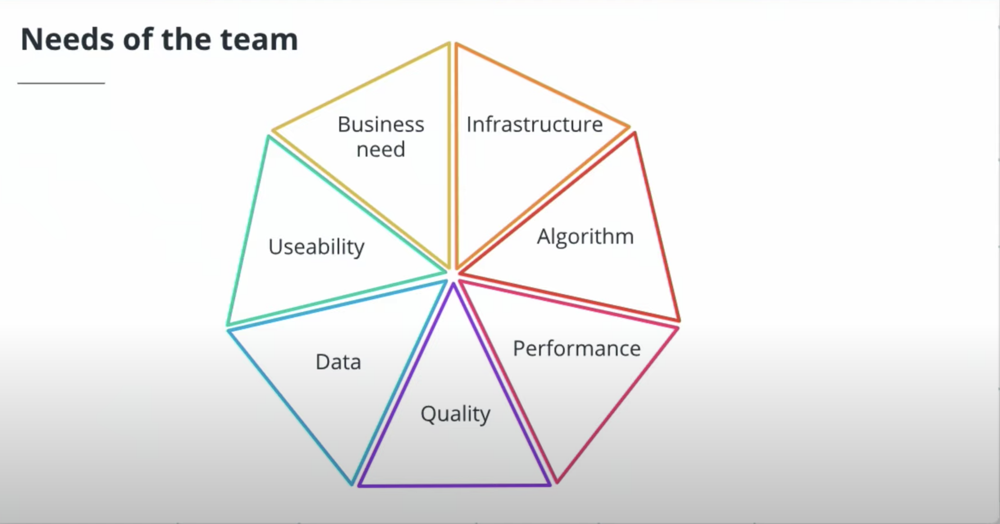
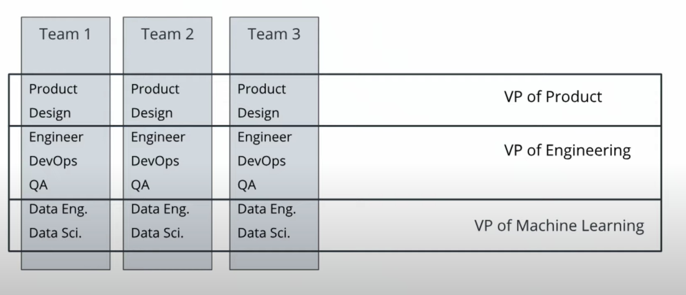
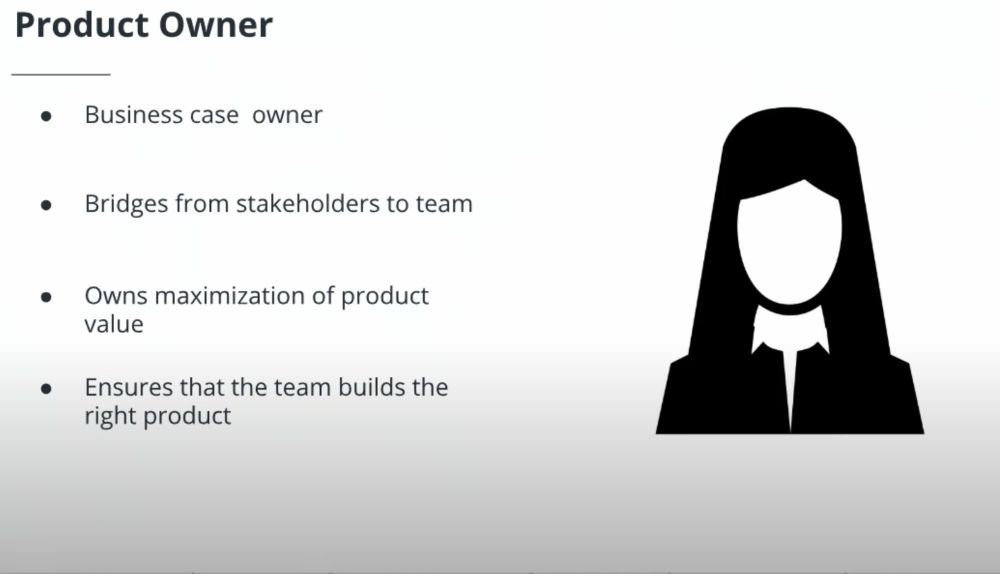
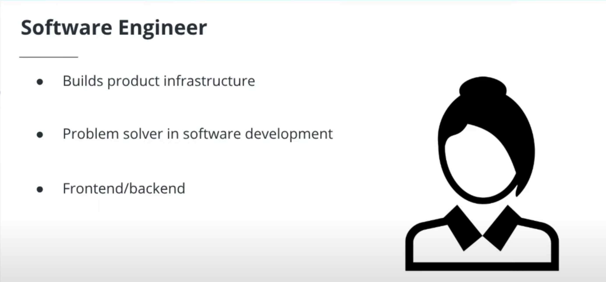
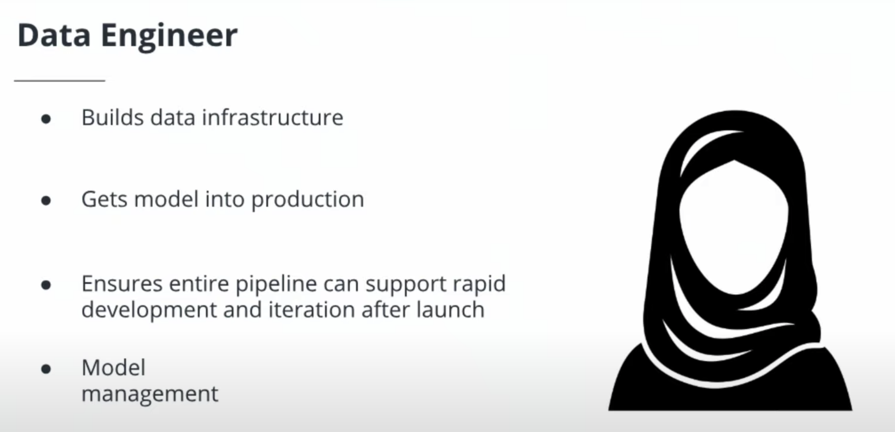
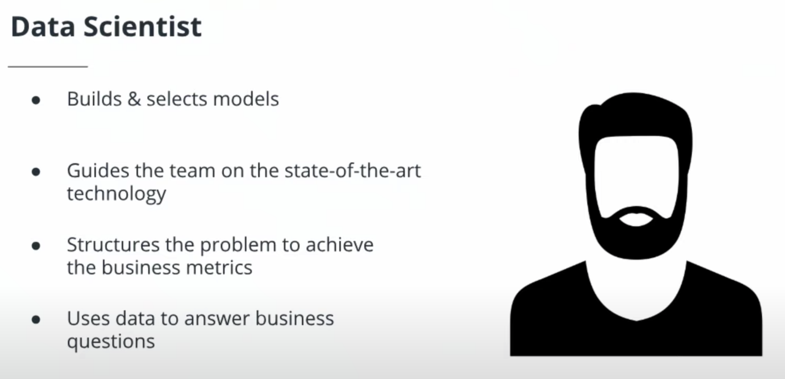
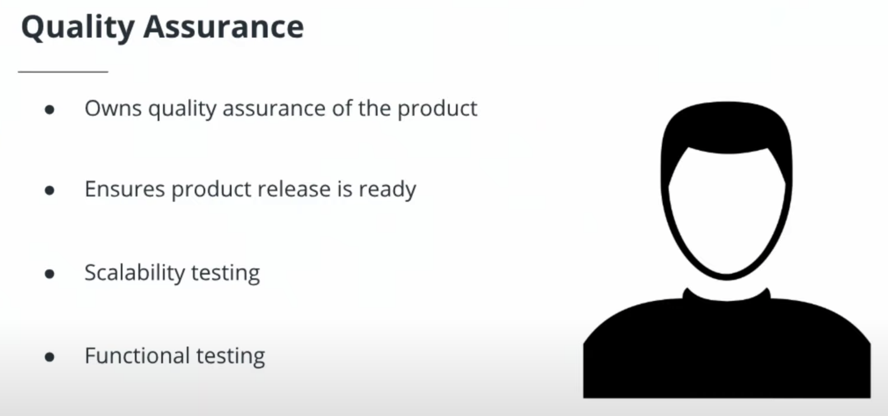
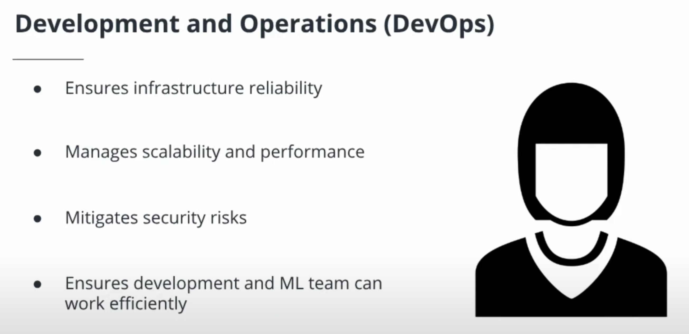
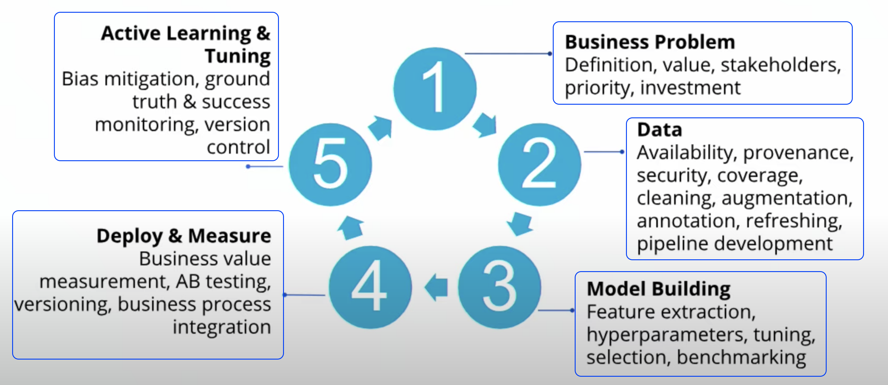
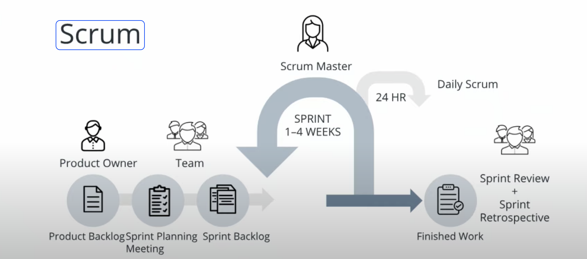

# Using AI and Machine Learning in Business

This section centres on how to build a successful AI product. Learn which kinds of narrow business cases can stand to benefit the most from machine learning and identify the components of an effective, AI product team.

## AI Application In Business

Here are several examples of ways real companies are using AI today. They are:

- Facial recognition,
- Retail inventory management,
- E-commerce search relevance,
- customer support automation
- Data categorization and classification
- Agricultural automation
- Autonomous vehicles (Self driving cars)
- Optical Character Recognition (**OCR**)
- Manufacturing efficiency and control
  ...

## AI Approach

### A typical approach to AI starts with data.

Below is a typical pipeline used by many machine learning teams to build products.

They are :

- Spend some time cleaning and organising
- Jump into building the model
- Test and validate it.
- Then, push it for deployment.

> However, the truth of the matter is that it should start with the business problem.
> Why build something when it is not solving a problem?
> It does not make sense unless you plan to waste money.

### Why should you start with the business problem?

Starting with the business problem give you the room to build a product that adds value.

_Think of it this way. It's like packing for a trip, but you do not know the destination._

> Simply put, business needs drive the data needs not the other way around.

**AI Approach that realises business value.**

However, production systems actively learn from humans.
You will have a human in the loop process to learn from and give that feedback to the model. See the image below.

> In this case, Active Learning means a model can learn from data labelled by human annotators and experts.

**Production systems actively learn from humans.**

Typically, when building an AI product, you have to define the project statement. As a product manager, it is crucial to communicate with the stakeholders about what problem we are solving.
Consider these questions as a guide. They are :

- How does the AI add value?
- What data are needed?
- Define the scope of the project.
- How do we measure success?

With the questions, it means you have a narrow and measurable articulation of a business goal.

Okay cool!. We've got asking the right questions out of the way.

Let's talk about metrics a bit.

### Metrics

Metrics, metrics, metrics are vital. I cannot stress how much it is needed.
What makes a metric effective?
An effective metric must be :
easily measurable

- directly correlate to the business performance.
- predictive of future business outcomes.
- comparable to the competitors' metrics.

### Team

The need for a team cannot be overlooked. To have a successful product launch, it depends on the team as well. Below are various pieces of your product for a successful launch.
**The need for a team.**

However, the reality is that cross-functional teams are crucial for driving the business outcome. It would be best if you had a team of folks who cut across different disciplines. You can also have multiple teams running in parallel.
Like the image shown below.

> Reality: Cross-functional teams are crucial for driving the business outcome

**Reality: Cross-functional teams are crucial for driving the business outcome**

That said, let's discuss a couple of key roles.

**Product Owner**

**Designer**

**Software Engineer**

**Data Engineer**

**Data Scientist**

**Quality Assurance**

**DevOps**

### Project Management (Timing)

**How much time should this take**

🙋🏾‍♂️ Often asked question here is?

> How much time should this take ?   **Answer:** it depends.

The process is no different from typical scrum and agile.
I highly recommend scrum.
**Scrum**

**Scrum** is a framework for prototyping and improving on product ideas. Learn more about it [here](https://www.atlassian.com/agile/scrum)

This process could take a week, a day, end to end or could take six months depending on how fast you can learn and iterate.

Deploying and measuring really depends a lot on your tooling and your infrastructure that you're using, or if you're going to build that all from scratch.

### Summary

**My leaving note here is,**

- Always, start with the business problem.
- Ensure you have the correct data. (_poor data gives you a poor model._)
- Build an interdisciplinary team.
- Learn and iterate fast 🏃🏾‍♂️🏃🏾‍♂️🏃🏾‍♂️🏃🏾‍♂️

Thank you for reading.
