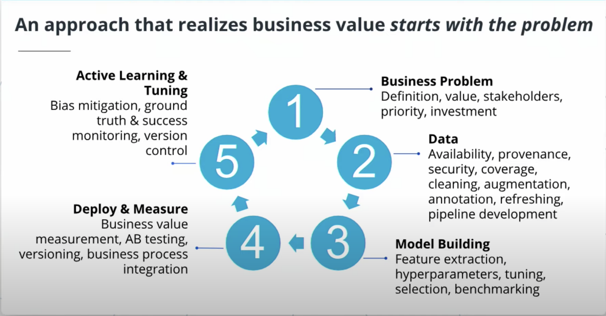
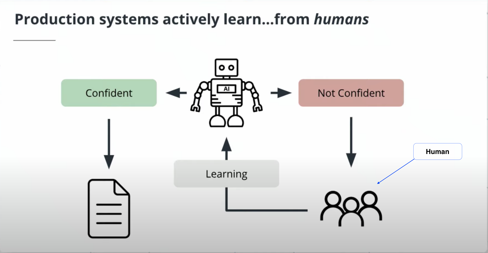

# Using AI and Machine Learning in Business

This section centres on how to build a successful AI product. Learn which kinds of narrow business cases can stand to benefit the most from machine learning and identify the components of an effective, AI product team.

## AI Application In Business

Here are several examples of ways real companies are using AI today. They are:

- Facial recognition,
- Retail inventory management,
- E-commerce search relevance,
- customer support automation
- Data categorization and classification
- Agricultural automation
- Autonomous vehicles (Self driving cars)
- Optical Character Recognition (**OCR**)
- Manufacturing efficiency and control
  ...

## AI Approach

### A typical approach to AI starts with data.

Below is a typical pipeline used by many machine learning teams to build products.

They are :

- Spend some time cleaning and organising
- Jump into building the model
- Test and validate it.
- Then, push it for deployment.

> However, the truth of the matter is that it should start with the business problem.
> Why build something when it is not solving a problem?
> It does not make sense unless you plan to waste money.

### Why should you start with the business problem?

Starting with the business problem give you the room to build a product that adds value.

_Think of it this way. It's like packing for a trip, but you do not know the destination._

> Simply put, business needs drive the data needs not the other way around.

**AI Approach that realises business value.**

However, production systems actively learn from humans.
You will have a human in the loop process to learn from and give that feedback to the model. See the image below.

> In this case, Active Learning means a model can learn from data labelled by human annotators and experts.

**Production systems actively learn from humans.**

Typically, when building an AI product, you have to define the project statement. As a product manager, it is crucial to communicate with the stakeholders about what problem we are solving.
Consider these questions as a guide. They are :

- How does the AI add value?
- What data are needed?
- Define the scope of the project.
- How do we measure success?

...TBC
